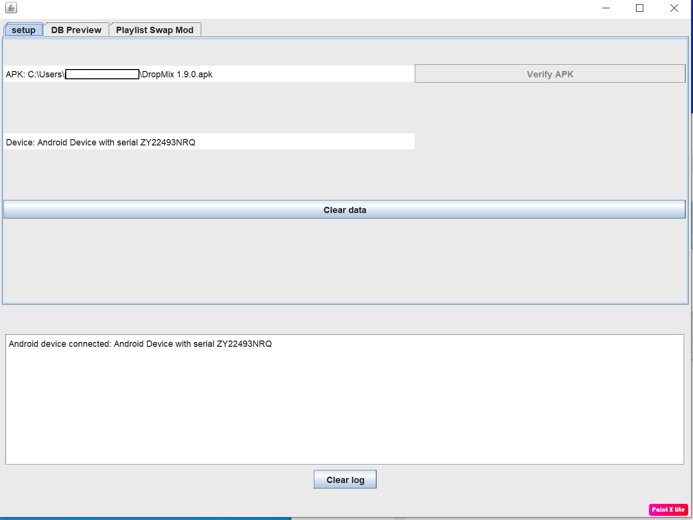

# Visual guide

[images may not match current app UI exactly and are taken from an early version]

The application contains logs while running, by cross referencing with the logs in these images you will hopefully be able to detect where things go awry if there are issues.

## Basic setup with images

For generating an APK which you will manually transfer to your android device

### 1. Initial setup

Either click on the .jar file (either your own build or gotten from https://github.com/padraigfl/Java-Dropmix-Toolkit/releases) or via the command line run

``` java -jar [pathToJarFileGoesHere]/DropmixModdingTool.jar ```

If there are issues here make sure you have a valid version of Java running on your system. If you don't know how to do this you probably shouldn't be messing with programs from Github written by god knows who.

On loading click confirm on the initial dialog rant and either accept or deny any requests surrounding ADB (see below for more info on this)

### 2. Add APK file from computer


Source a copy of Dropmix's APK (Version 1.9.0) and add it into the application


### 3. Verify APK contents


Once the APK has been added, click the verify button. This will pull card and playlist data from the asset files to prepare the program for further actions. If you are not using Dropmix 1.9.0 this section will fail.
Do not click the verify button multiple times, let the process complete as in the log files


### 4. Go to playlists tab, download re-signed APK


On the first run use the "Build re-signed APK" button to get a new version of the APK that has been signed with the same key and certificate as all modified APKs will be. This is useful as Android will have issues with an APK being installed over by another with a different signature. This process and the swap processes can take a while on slower computers

### 5. Select playlists you wish to swap, click apply swap button


This will take longer than other processes as it needs to decompile the APK, apply modifications, recompile the APK and sign the APK again.

I recommend using the "Safe Swap" action as it's less likely to result in Dropmix requesting a full asset refetch after each install. 

The full swap log should contain roughly the following logs:
[1](playlist-swaplog1.png)
[2](playlist-swaplog2.png)
[3](playlist-swaplog3.png)
[4](playlist-swaplog4.png)

### 6. Save modified apk


After the swap has completed, you can use this to save the generated APK file

### 7. Move APK to phone, install

Move the APK to your phone and install it. If you are using an official Dropmix APK you will need to uninstall that before installing a modified version. As the APK is using an arbitrary signature you will have to confirm that you're okay with a bunch of security risks when installing.

### 8. First run after install

If you do not already have Dropmix card data on your phone, or if you have used the "Full Swap" action you will need to do a full card install via the "Download All Card Contents" action in the application or copy a backup to the phone.

If you DO have Dropmix card data on your phone, you should turn off your internet before using the application. Failure to do this may result in the application insisting on redownloading the assets.

## ADB functionality

By using ADB you can directly install a modded APK to a connected device. You need to have USB debugging enabled on the device and a whole load of permissions grants (permission for adb to communicate on private networks, permission for your phone to communicate with ADB on your computer, probably others).

Provided you connect a device on the setup screen you can then use the "Install APK" button. On first run this may require your phone to accept some permissions.



